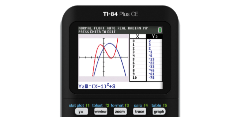

  
The CE stands for **Color Enhancement**. The TI-84 Plus CE is the newest graphing calculator from Texas Instruments that launched in 2015. Each graphing calculator comes with a LED color display screen.
