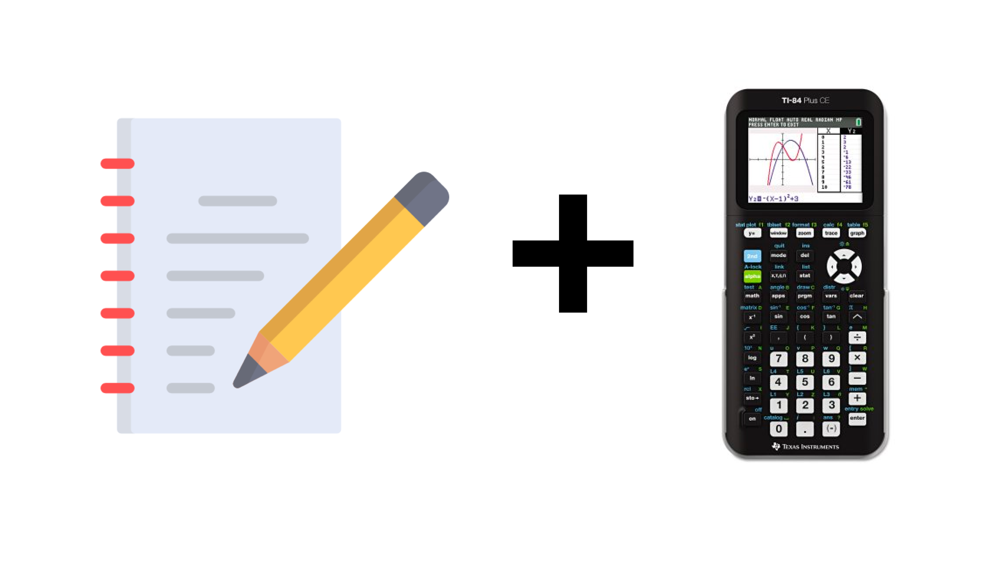

Adding notes to your graphing calculator is easy and will help you during classes and exams.
  

1. In nibh mauris cursus mattis molestie a. Semper eget duis at tellus at. Molestie a iaculis at erat pellentesque adipiscing commodo elit. Lorem ipsum dolor sit amet consectetur. Pharetra diam sit amet nisl suscipit adipiscing bibendum. 

2. Odio morbi quis commodo odio aenean sed. Venenatis tellus in metus vulputate. Semper risus in hendrerit gravida. Adipiscing tristique risus nec feugiat in fermentum. Auctor urna nunc id cursus. Fames ac turpis egestas sed tempus urna et. Egestas egestas fringilla phasellus faucibus scelerisque eleifend.  

3. Quam quisque id diam vel quam elementum. Varius sit amet mattis vulputate enim nulla aliquet porttitor. Lorem ipsum dolor sit amet consectetur adipiscing. Nisl purus in mollis nunc sed id semper risus.